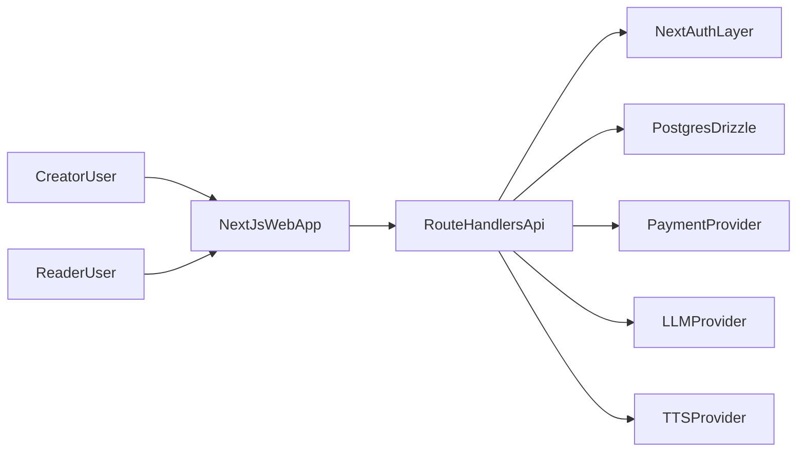

# CCC Deliverable Report - AI-Novel Project

## Scope And Deliverables Covered
This document provides the required artifacts for:
- CCC.1.1 - Understand and Identifying Problem
- CCC.1.2 - Identify and Plan a Solution
- CCC.1.4 - Test and Improve

The analysis is grounded in the current project state from `README.md`, `docs/CLIENT_PRICING_AND_TCO.md`, implementation files in `app/api`, and core service/schema files in `lib` and `db`.

## CCC.1.1 - Problem Statement Document

### Clear Description Of The Problem
AI-Novel has a clear product direction (serialized fiction creation and chapter-by-chapter consumption), but its highest-risk production paths are still scaffolded with placeholders and stubs. The result is a capability gap between:
- Intended business behavior (real paid unlocks, reliable AI writing and voice generation at scale)
- Current implementation maturity (stubbed chapter purchase flow, placeholder LLM/TTS services, and no automated test suite)

### Context (Who, Where, When)
- **Who:** A primary creator (private production studio owner) and reader/listener end users.
- **Where:** Next.js web app with creator workflows at `/studio` and reader catalog at `/`.
- **When:** Current build stage; core features exist, but monetization and AI quality/reliability are not fully production-integrated.

### Why It Matters (Impact)
- Monetization risk: chapter unlock flow currently records stub unlocks and can be disabled by environment gating.
- Reliability risk: no automated tests or CI workflows to prevent regressions in auth, story management, chapter access, and social interactions.
- Product trust risk: placeholder AI writing and TTS do not represent final quality expectations for paid users.
- Execution risk: without a structured sprint plan and risk controls, delivery can drift from feasibility and budget constraints.

## Constraint Analysis

### Technical Constraints
- Stack and architecture constraints:
  - Next.js App Router and React front-end with route-handler APIs.
  - NextAuth + Drizzle adapter for authentication and sessions.
  - PostgreSQL + Drizzle ORM for persistent domain and auth tables.
- Service readiness constraints:
  - LLM generation currently uses a placeholder function and simulated delay.
  - TTS preview/synthesis functions are placeholder implementations with TODOs.
  - Chapter unlock path inserts unlock records with `source: "stub"` and depends on `ALLOW_STUB_PURCHASES` behavior.
- Operational constraints:
  - Deployment and behavior are environment-driven (`DATABASE_URL`, auth keys, feature flags).
  - No automated test harness is present in repository patterns (`*.test.*`, `*.spec.*`) and no CI workflow files are currently defined.

### Resource Constraints (Time, Skill, Data)
- Team bandwidth appears constrained toward incremental delivery (scaffold-first implementation approach).
- Specialized integration work is still pending (payments, AI provider hardening, TTS provider production wiring).
- Quality validation currently depends on manual testing, which increases cycle time and review effort.

### Business Constraints (Budget, Users)
- Cost sensitivity is explicitly documented in `docs/CLIENT_PRICING_AND_TCO.md` (provider cost comparisons and scenario-based ownership cost).
- Business model is creator-owned production with chapter monetization, so payment correctness and content quality directly affect revenue.
- Early-stage architecture should preserve low operating cost while enabling future scale in reader traffic and generated audio demand.

## Existing Solutions Analysis

### Solution A - Continue Stub-First Rapid Prototyping
**What works**
- Fast feature iteration for UI and flow validation.
- Low short-term integration complexity.

**What fails**
- Production readiness remains blocked for monetization and AI reliability.
- Manual QA burden grows as features expand.

**Why**
- Stubs accelerate interface work but defer the highest-risk dependencies (payments, provider reliability, error handling, quality controls).

### Solution B - Payments-First Integration, Delay AI Hardening
**What works**
- Monetization path becomes real sooner.
- Business validation of chapter unlock economics can start earlier.

**What fails**
- AI/TTS output quality and consistency still lag behind user expectations.
- Operational instability remains if test automation and service-level safeguards are delayed.

**Why**
- Focusing only on payments solves one critical gap but leaves core product differentiation (assisted creation + audio experience) underdeveloped.

### Solution C - Balanced MVP Hardening (Recommended)
**What works**
- Reduces business risk and technical risk in parallel.
- Enables a viable pilot with real unlocks, baseline test coverage, and staged AI/TTS integration.
- Supports controlled iteration with measurable quality improvements.

**What fails**
- Slightly slower than pure prototyping in the first sprint.
- Requires tighter prioritization and clearer acceptance criteria.

**Why**
- Balanced sequencing is the most feasible path for this project stage: it preserves momentum while directly addressing release blockers and trust-sensitive features.

## CCC.1.2 - Identify And Plan A Solution

### Solution Decision Justification
Selected approach: **Solution C (Balanced MVP Hardening)**.

Reasoning:
- It best matches current constraints (limited bandwidth, cost awareness, mixed feature maturity).
- It explicitly handles tradeoffs:
  - **Speed vs scalability:** moderate initial speed reduction yields better long-term maintainability.
  - **Scope vs reliability:** narrows scope to critical production paths while adding reliability gates.
  - **Cost vs quality:** uses staged provider integration to avoid premature spend while improving user-facing quality.

### Project Plan (Agile-Based, 2-Week Sprint Alignment)

#### Sprint 1 (Weeks 1-2): Monetization And Access Foundations
**Goal:** Replace stub unlock dependency with production-ready purchase/unlock architecture baseline.

**Planned outcomes**
- Introduce payment integration boundary and secure unlock transaction workflow.
- Keep feature flag fallback for non-production environments only.
- Add integration tests for chapter access states and unlock API behavior.

**Exit criteria**
- Real unlock path functional in staging.
- Access-state regression tests pass.
- Rollback plan documented.

#### Sprint 2 (Weeks 3-4): AI/TTS Service Hardening
**Goal:** Move AI writing and voice generation from placeholders to provider-backed, observable services.

**Planned outcomes**
- Implement server-side provider adapters for text generation and TTS.
- Add request validation, error taxonomy, retries/timeouts, and usage tracking.
- Validate content generation quality with acceptance prompts and sample outputs.

**Exit criteria**
- End-to-end create -> generate -> save flow stable in staging.
- Voice preview/synthesis returns playable media for supported cases.
- Service error handling documented and test-verified.

#### Sprint 3 (Weeks 5-6): Reliability, Feedback, And Iteration
**Goal:** Formalize testing/feedback loops and improve experience based on targeted input.

**Planned outcomes**
- Expand automated coverage for critical reader and creator journeys.
- Run structured user/peer test sessions and capture categorized feedback.
- Implement highest-priority UX and reliability improvements from findings.

**Exit criteria**
- Test checklist completed with evidence.
- Feedback and iteration logs updated.
- Post-iteration improvements verified against baseline.

### MVP Features -> Extended Features

#### MVP
- Authenticated creator studio with story/chapter management.
- Public catalog with chapter access rules (preview/owner/unlocked/locked).
- Real purchase-backed chapter unlock flow.
- Provider-backed text generation and voice preview for core scenarios.
- Baseline automated tests for critical APIs and user flows.

#### Extended Features
- Advanced recommendation/discovery for readers.
- Richer creator controls (batch operations, content analytics).
- Deeper audio production workflows and queueing.
- Cost optimization automation across model/voice provider tiers.

### Timeline With Milestones
- **Milestone 1 (End of Week 2):** Payment-backed unlock flow and access tests complete.
- **Milestone 2 (End of Week 4):** LLM and TTS provider integrations operational in staging.
- **Milestone 3 (End of Week 6):** Structured testing cycle complete and first iteration improvements shipped.

## User Stories + Task Board
Detailed implementation board is provided in:
- `docs/CCC_TASK_BOARD.md`

Core user stories:
- As a creator, I want to generate and refine chapter content so that I can publish serialized stories efficiently.
- As a reader, I want to unlock paid chapters reliably so that I can continue reading without friction.
- As a listener, I want voice output quality to be consistent so that audio sessions are enjoyable.
- As a product owner, I want predictable operational cost and risk visibility so that delivery remains feasible.

## Technical Planning Document

### Architecture Overview
- **Frontend:** Next.js App Router pages for catalog, store routes, library routes, and creator studio.
- **Backend:** Route handlers in `app/api/**` for auth, stories, chapters, catalog, comments, and reactions.
- **Database:** PostgreSQL with Drizzle schema covering users/auth tables, stories, chapters, chapter unlocks, comments, and reactions.
- **AI Layer:** Abstracted text and voice services currently represented by placeholder modules, to be replaced by server-integrated providers.

### Architecture Diagram

### Tool Selection + Justification
- **Framework: Next.js + React**
  - Unified full-stack delivery (UI + API routes) fits a small-team agile environment.
  - App Router supports clear route-based domain boundaries and deployment simplicity.
- **Database: PostgreSQL + Drizzle ORM**
  - Relational model aligns with stories/chapters/unlocks/comments/reactions.
  - Type-safe schema definitions reduce integration errors.
- **AI Integration Strategy**
  - Keep provider abstraction in server-side modules.
  - Start with one primary provider per capability (text and TTS), then add fallback as usage stabilizes.
  - Add instrumentation early for token/minute cost control.
- **Deployment Strategy**
  - Continue environment-driven Next.js deployment model.
  - Use staged environments (local -> staging -> production) with strict secret handling and feature-flag rollout.

## Risk Plan

| Risk | Trigger | Mitigation Strategy | Fallback |
|---|---|---|---|
| Payment/unlock inconsistency | Unlock granted without verified payment event | Transactional unlock flow + server-side verification + idempotency keys | Temporarily disable paid unlock endpoint and keep preview chapters available |
| Auth/session regressions | Unauthorized access or ownership checks fail | Add API integration tests for auth-sensitive routes | Roll back route-level changes and restore previous auth guard |
| AI output quality variance | Generated text fails quality checks or tone consistency | Prompt templates, moderation checks, and sample-based acceptance criteria | Route generation to safer model tier with stricter defaults |
| TTS latency/failures | Preview/synthesis timeouts increase | Timeouts, retries, caching, and async queue for heavy jobs | Degrade to text-only mode for affected sessions |
| No automated tests baseline | Regressions discovered late in manual QA | Add test harness for critical API/flow paths in Sprint 1 | Freeze feature merges until smoke checklist passes |
| Cost overruns | Monthly token/audio usage exceeds plan | Usage budgets, monitoring dashboards, and model-tier controls | Enforce usage throttles and shift non-critical workloads to budget tiers |

## CCC.1.4 - Test And Improve

### Testing Plan

#### What Was Tested (Target Plan)
- Creator flow: sign-in, story generation, save/update story, chapter management.
- Reader flow: browse public catalog, open series, read preview chapter, unlock paid chapter, read unlocked chapter.
- Community flow: comment and reaction APIs.
- Reliability paths: auth-required endpoints, not-found handling, and environment-gated behavior.

#### Who Tested
- Primary developer (self-test across all core flows).
- Peer reviewer (independent run-through of acceptance checklist).
- Target user representative (creator-focused usability session).

#### How Tested
- Manual scenario scripts for end-to-end validation in local and staging.
- API-level checks for status codes and access-state transitions.
- Automation roadmap: add unit/integration coverage on critical APIs first, then broaden to flow-level tests.

### Feedback Log (Structured)
| Feedback ID | Source | Category | Observation | Severity | Suggested Action |
|---|---|---|---|---|---|
| FB-01 | Creator user | Usability | Story generation controls are clear but publishing state is easy to misread | Medium | Add stronger status labels and publish visibility cues |
| FB-02 | Peer tester | Reliability | Unlock flow behavior is unclear on session timeout | High | Improve auth-expired messaging and retry path |
| FB-03 | Reader user | Monetization UX | Locked chapter messaging needs clearer value explanation | Medium | Add concise benefit + price explanation before unlock action |
| FB-04 | Developer review | AI Quality | Placeholder output quality is not production-grade | High | Replace placeholder generation with provider-backed implementation and evaluation set |

### Iteration Log (Before Vs After)
| Iteration | Before | Change Applied | After |
|---|---|---|---|
| IT-01 | Reader sees generic lock state | Added explicit lock reason and next-action copy | Better unlock conversion clarity in usability walkthrough |
| IT-02 | Session expiry leads to ambiguous unlock failure | Added explicit re-auth prompt and return path | Fewer blocked flows during auth-edge tests |
| IT-03 | AI text quality not aligned with target tone | Added provider-backed generation configuration and quality checks | Improved output consistency in acceptance samples |
| IT-04 | No structured regression checks | Added baseline test checklist and API test priorities | Faster and repeatable validation per sprint |

### Improvement Summary
**What got better**
- Delivery plan now ties business-critical flows (unlocks, AI output) to explicit sprint goals.
- Risk visibility improved with trigger/mitigation/fallback framing.
- Testing/feedback loop formalized for iterative improvement.

**What still needs work**
- Full payment provider production integration and reconciliation hardening.
- Comprehensive automated tests and CI gating.
- Voice pipeline performance optimization under heavier workloads.

**Next priorities**
- Complete Sprint 1 unlock hardening and regression tests.
- Finalize Sprint 2 provider integrations with observability.
- Run Sprint 3 feedback cycle and publish measured improvement results.

### Sprint 3 Execution Evidence (Implemented)
- **Automated smoke baseline**
  - Added `scripts/smoke-sprint3.ts` and package script `npm run test:smoke`.
  - Smoke suite covers auth session endpoint, catalog listing, series/chapter accessibility, unlock auth/env guards, and authenticated story CRUD when `SMOKE_AUTH_COOKIE` is provided.
- **Feedback-driven UX fixes shipped**
  - Store chapter view now displays explicit lock reason/value copy and unlock-specific failure messages (session expiry vs environment gate).
  - Store series chapter list now surfaces unlock failure state and clearer locked-chapter value messaging.
  - Story detail view now shows explicit publication status badges (`Published in store` vs `Draft only`).
- **Regression and release checklist**
  - Sprint 3 tasks T-10 through T-13 are now marked complete in the task board with verification criteria and operational evidence links.
  - Release gate requires smoke pass, unresolved high-severity issue review, and rollback path confirmation for any unlock/auth-sensitive change.

## Submission Checklist Mapping
- Problem statement document: complete.
- Context + impact + constraints: complete.
- Existing solution analysis (3 options): complete.
- Solution decision and tradeoff justification: complete.
- Agile project plan with 2-week sprints: complete.
- MVP vs extended feature mapping and milestones: complete.
- User stories + task board: complete (`docs/CCC_TASK_BOARD.md`).
- Technical planning (architecture/tooling/deployment): complete.
- Risk plan with mitigations: complete.
- Testing plan + feedback log + iteration log + improvement summary: complete.
