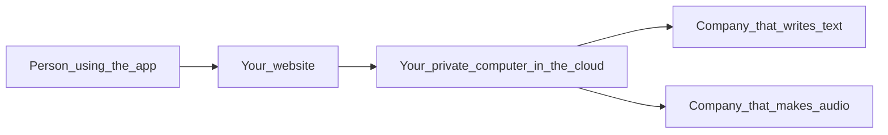

# AI Novel — What it costs (plain English)

**Who should read this:** Anyone who approves money or signs contracts—you do **not** need a tech background.  
**Currency:** U.S. dollars (**USD**).  
**Last checked:** 2026-04-22. **Prices on the internet change.** Before you budget or sign, open the links in [Official price pages](#official-price-pages) and check today’s numbers.

---

## How she plans to use this (product shape)

This is **not** framed as an open marketplace where many writers share one public “studio.” The client wants the **production space to be hers alone**—a private place to create and control her catalog.

**How it earns money** is closer to **[Pocket FM](https://pocketfm.com)** than to a generic writing site: **long serials** (novels as ongoing series) sold **chapter by chapter** (and often listened to as audio) to **paying customers**. She **uses AI to generate and refine** stories that **she** publishes; end buyers are **readers/listeners**, not co-authors in her workspace.

That matters for cost thinking below: **writing bills** track how much **she** generates while building each title; **voice bills** track how much **finished audio** exists for customers to play (whether you render once per chapter or generate on demand). The napkin math still uses “clicks” and “minutes,” but picture **studio output + catalog listens**, not “every random visitor writes their own novel.”

---

## The shortest version

You will pay for **two different things**:

1. **AI that writes the story** (like hiring a very fast typist who charges by the “amount of text”).  
2. **AI that reads the story out loud** (like a voice actor who charges by **minutes of audio** or a monthly plan).

Those two bills **do not** work the same way. This guide explains both, then shows **very rough** five-year examples so you have a ballpark.

---

## Before you sign anything

- **Prices change.** Always look at the vendor’s own website on the day you decide.  
- **Names matter.** A “budget” or “Flash” style product is usually cheaper than a “top” or “Pro” one—**cheaper does not always mean worse**, but you should listen to samples.  
- **This is not a quote.** It is education only—not a promise from us, not legal or tax advice.

---

## Words we use (simple definitions)

| If we say… | It means… |
|------------|-----------|
| **AI writer** | The computer service that **writes or rewrites** story text when someone clicks generate. |
| **Word-chunk (“token”)** | How companies **measure text** for billing. **Not** “one word = one chunk.” Think: **about 4 letters of English ≈ one chunk**—close enough for guessing, not exact. |
| **“Sent in”** | Everything you **give** the AI: instructions, settings, old paragraphs, etc. |
| **“Written out”** | Everything the AI **gives back**. Longer answers **usually cost more**. |
| **Read-aloud voice** | Turning text into **spoken audio**. Your app is meant to use **many short clips** (different speakers, timeline). You mostly pay for **how much audio you make**, not for “word-chunks” like the writer. |
| **“Total cost of ownership”** | **All costs over time:** AI bills, voice bills, keeping the website online, tools, and **people** who build and fix things. |

---

## Where the money goes (when the product is finished)

Today the app still uses **fake stand-ins** instead of real paid services—one for **writing**, one for **voices**. When it is finished, picture **her production pipeline** like this (customers later hit a separate reader/listener experience that plays what she published):

1. **Writing:** Each time someone generates or rewrites text, the **writer** company charges based on **how big** the request was and **how big** the answer was.  
2. **Voices:** The **voice** company charges based on **your plan** and **how much audio** you create (minutes, credits, or similar).

Because you may create **lots of small audio clips** (many lines, many speakers), the voice bill is often best tracked as **“minutes of audio per month”**—not mixed into the writing bill.

---

## Official price pages

Use these links on the day you buy:

| What you are buying | Official pricing page |
|----------------------|------------------------|
| OpenAI (writing) | https://openai.com/api/pricing/ |
| Anthropic / Claude (writing) | https://docs.anthropic.com/en/docs/about-claude/pricing |
| Google Gemini (writing) | https://ai.google.dev/gemini-api/docs/pricing |
| ElevenLabs (voices) | https://elevenlabs.io/pricing |

---

## Part 1 — Paying for the AI **writer**

### How they write the price on the website

They usually list dollars **per 1 million word-chunks** (“per 1M tokens”). **You are not buying a million at once.** Think of it like **gas for a car**: the sign says “price per gallon,” but you only pay for **how many gallons you actually pumped.**

**Cheaper “slow lane” options:** Some companies offer a **discount** if the job can wait (for example overnight). That can help for **big exports** or **bulk rewrites**, not for instant on-screen typing.

### Reading the tables below

- **“Sent in”** = what you type/send to the AI.  
- **“Written out”** = what the AI returns.  
- **“Repeat text cheaper”** (OpenAI only) = if the same big block of instructions is reused, part of the bill can drop—details are on their site.

### OpenAI (from their public page)

Numbers below are the **“standard”** prices they publish; very large jobs may have different rules on their site.

| Plain-English tier | Product name on their site | **Sent in** (per 1M word-chunks) | **Repeat text** (per 1M, cheaper) | **Written out** (per 1M) |
|--------------------|----------------------------|----------------------------------|-----------------------------------|--------------------------|
| Top | GPT-5.4 | $2.50 | $0.25 | $15.00 |
| Mid | GPT-5.4 mini | $0.75 | $0.075 | $4.50 |
| Budget | GPT-5.4 nano | $0.20 | $0.02 | $1.25 |

### Anthropic / Claude (from their public page)

| Plain-English tier | Product name | **Sent in** (per 1M) | **Written out** (per 1M) |
|----------------------|----------------|----------------------|--------------------------|
| Top | Opus 4.7 | $5.00 | $25.00 |
| Mid | Sonnet 4.6 | $3.00 | $15.00 |
| Budget | Haiku 4.5 | $1.00 | $5.00 |

Anthropic says **Opus 4.7** may count **up to about 35% more word-chunks** for the **same paragraph** as older versions—so real life can be a bit higher than a napkin calculation.

### Google Gemini (from their public page, paid text)

If someone sends an **enormously long** prompt (their rules talk about **over 200,000 word-chunks**), the **dollar rates change**. The table below assumes a **normal** prompt length.

| Plain-English tier | Product name | **Sent in** (per 1M) | **Written out** (per 1M) |
|----------------------|----------------|----------------------|--------------------------|
| Top | Gemini 2.5 Pro | $1.25 | $10.00 |
| Mid | Gemini 2.5 Flash | $0.30 | $2.50 |
| Budget | Gemini 2.5 Flash-Lite | $0.10 | $0.40 |

---

## Part 2 — One “generate story” click (writing only)

Imagine someone presses the button once and gets a **solid chunk** of story—about the size the app aims for by default (**roughly 8,000 characters**).

**For math only, we pretend:**

| Step | Round guess |
|------|-------------|
| How much we **send in** | **2,000** word-chunks |
| How much the AI **writes out** | **2,500** word-chunks |

**How to turn that into dollars (writing only), in words:**

1. Multiply **“sent in”** chunks by the **“sent in”** price per 1M (remember to divide by a million—or move the decimal six places).  
2. Multiply **“written out”** chunks by the **“written out”** price per 1M.  
3. **Add** those two dollar amounts.

**About what one click costs (writing only), with the guesses above:**

| Company / product | About per click* |
|-------------------|------------------:|
| OpenAI GPT-5.4 | ~$0.04 |
| OpenAI GPT-5.4 mini | ~$0.013 |
| OpenAI GPT-5.4 nano | ~$0.004 |
| Claude Opus 4.7 | ~$0.07 |
| Claude Sonnet 4.6 | ~$0.04 |
| Claude Haiku 4.5 | ~$0.015 |
| Gemini 2.5 Pro | ~$0.03 |
| Gemini 2.5 Flash | ~$0.007 |
| Gemini 2.5 Flash-Lite | ~$0.001 |

\*Rounded. Does **not** include special discounts, “search the web” extras, or special country rules.

**Simple lesson:** The **budget** row is often **many times cheaper per click** than the **top** row. Picking the writer is both a **money** choice and a **quality** choice—listen to real samples, not only spreadsheets.

---

## Part 3 — Paying for **read-aloud voices** (built into this product)

Most voice companies bill like a **phone plan**:

- You pick a **monthly tier** with some **included minutes or credits**.  
- If you go over, you pay **extra**—often shown as **dollars per minute** on their marketing pages.

**ElevenLabs (big picture from their public site):**  
They list plans from **Free** up to **Business** / **Enterprise**. Their public comparison talks about **roughly $0.17 to $0.36 per extra minute** on some tiers (that language is aimed at creators in their app; **automatic “API” billing** for your product may not match exactly—**ask them** before you promise a budget).

**Why small clips matter in *this* app:**  
The product is designed to make **one audio piece per speech bit** (previews, then lines on a timeline). That can mean **many short files** instead of one long recording. Some systems have a **minimum charge per file**, so **one hundred tiny clips** might not cost the same as **one clip of the same total length**—a short pilot month is the honest way to learn your real bill.

### Voice numbers we use **only as placeholders**

We use **$0.25 per minute** of **new** AI speech in a month so you can plug numbers into a spreadsheet. **Replace this** with ElevenLabs’ (or whoever you pick) **written quote** before you freeze a budget.

| Placeholder | Value |
|-------------|-------|
| Cost per minute of new speech | **$0.25** |
| What “minutes” means here | All **new** read-aloud audio produced in a month (every clip added together)—usually **catalog + new chapters** listeners can play, not “every visitor making their own audio.” |

If your real overage is closer to **$0.18** or **$0.32** per minute, multiply the voice lines in Part 4 up or down by that ratio.

---

## Part 4 — Five-year **examples** (writing + voices together)

**Honest limits:** We take **monthly cost × 60 months**. We **do not** predict inflation, sales growth, or price wars. Treat the totals as **“order of magnitude,”** not a promise. For a **Pocket-FM-style** business, scale the **writing** rows with **how many chapters she ships** and the **voice** rows with **total published listen time** (or replays if you re-render)—tune the tables to her release cadence, not to “everyone writes.”

**Same writing guess as Part 2:** each “generation” = **2,000 in + 2,500 out** word-chunks.  
**Voice:** uses the **$0.25/minute** placeholder above.

### Small launch (“pilot”)

| Line item | How much use (per month) | In plain English | **About / month** | **About 5 years** |
|-----------|--------------------------|------------------|------------------:|------------------:|
| Writing (Claude Sonnet 4.6) | 500 clicks | 500 × ~$0.04 each | **~$22** | **~$1,300** |
| Voices | 800 minutes new audio | 800 × $0.25 | **~$200** | **~$12,000** |
| **Pilot total** | | | **~$222** | **~$13,300** |

### Growing use

| Line item | How much use (per month) | **About / month** | **About 5 years** |
|-----------|--------------------------|------------------:|------------------:|
| Writing (Sonnet 4.6) | 5,000 clicks | **~$218** | **~$13,100** |
| Voices | 8,000 minutes | **~$2,000** | **~$120,000** |
| **Growth total** | | **~$2,218** | **~$133,100** |

### Heavy use

| Line item | How much use (per month) | **About / month** | **About 5 years** |
|-----------|--------------------------|------------------:|------------------:|
| Writing (Sonnet 4.6) | 50,000 clicks | **~$2,175** | **~$131,000** |
| Voices | 80,000 minutes | **~$20,000** | **~$1,200,000** |
| **Heavy-use total** | | **~$22,175** | **~$1,331,000** |

**What jumps out:** In these examples, **voices can cost far more than writing**—that is common when people actually **listen** a lot. Your real world depends on how often people press “make audio,” how long clips are, and **which ElevenLabs plan** you buy (included minutes lower the overage).

**Same small launch, but cheapest writing row (Gemini 2.5 Flash-Lite)** — voices unchanged:

| | About 5 years |
|--|---------------:|
| Writing only | **~$36** |
| Voices only | **~$12,000** |
| **Both** | **~$12,036** |

---

## Other costs (not the AI writer or ElevenLabs bill)

| Topic | Plain English |
|-------|----------------|
| **Website hosting** | Rent for the app to live online. Often a **fixed monthly** or “pay more if traffic explodes.” |
| **Domain & email** | Small yearly items unless your company bundles them. |
| **Error tracking (“logging”)** | Tools that show what broke. Can be **free** or **hundreds a month** if you want deep detail. |
| **Accounts & saved work** | If **listeners** log in to buy chapters (and/or **your team** saves drafts), you may pay another company **by users** or **by storage**—get a range early. |
| **Keeping the product healthy** | Many teams plan **about 15–25% of the original build cost per year** for fixes and small upgrades, **or** pay a monthly “on call” fee to a developer. |

---

## What it costs to **hire someone to build** this (not the AI bills)

These are **typical U.S.-style talking ranges** for contractors or agencies—**not** a formal bid from anyone.

### Common ways to pay a builder

| Way to pay | Plain English |
|------------|----------------|
| **Fixed price** | “Deliver these features for $X.” Best when everyone agrees **exactly** what “done” means. Changes = **new paperwork / new price**. |
| **Hourly** | Pay for time spent. Good when you expect **trying different voices or models**. Ask for a **weekly hour cap** so you do not get a shock bill. |
| **Retainer** | Pay monthly for a bucket of hours after launch—good for **steady tweaks**. |

### Rough hourly rates (USD, ballpark)

| Who / where | Typical hourly range |
|-------------|----------------------:|
| U.S. / Canada, very experienced | $150–$250 |
| U.S. / Canada, mid-level | $100–$150 |
| Western Europe, experienced | $100–$180 |
| Nearshore | $45–$95 |
| Offshore | $25–$55 |

### Rough effort for **what is already started** in this project

The project already has **screens** and **hooks** where real writing and real voices will plug in. Finishing a **first shippable version** (secrets kept safe on the server, real writing working, real voices working, basic error tracking, live on the internet) is often **about 80 to 200 hours**, depending on logins, saving work to a database, waiting-in-line (“queue”) systems, and how polished the voice workflow must be.

**Example math only (not a quote):** 140 hours × $125/hour ≈ **$17,500** of labor **before** heavy testing, lawyer review, or taking payments from customers.

---

## Appendix A — Your own numbers (copy to a spreadsheet)

| Question | Your answer |
|----------|-------------|
| How many **story clicks** per month (studio / her workflow)? | |
| On a test bill, how many **word-chunks sent in** and **written out** per click? | |
| Which **writing product** will you ship? | |
| How many **minutes of new voice audio** per month (published catalog, all clips added up)? | |
| Which **voice company and plan**? | |
| Do you need **“search the web” inside the AI”** or other paid add-ons? | |

---

## Appendix B — Before launch (keep money and users safe)

- [ ] **Secret keys** (passwords to the AI and voice companies) live **only on your server**, never inside the user’s web browser.  
- [ ] **Fair-use limits** so one person cannot burn the whole month’s budget in an hour.  
- [ ] A simple **usage report**: writing word-chunks in/out, and **voice minutes or credits** used.  
- [ ] **Reuse big instructions** where the same long “style guide” is sent every time—it can lower writing cost (details on each vendor’s site).  
- [ ] **Overnight jobs** where nobody is waiting at the keyboard—sometimes cheaper.  
- [ ] Written rules for **offensive or illegal content** and what you will remove.  
- [ ] If data must stay in a **specific country**, get that in **writing** from each vendor.

---

## Document history

| Version | Date | Notes |
|---------|------|-------|
| 1.0 | 2026-04-22 | First version. |
| 1.1 | 2026-04-22 | Voice as core product; combined five-year examples. |
| 1.2 | 2026-04-22 | Layman’s pass: simpler words, fewer file names, friendlier diagrams and tables. |
| 1.3 | 2026-04-27 | Client vision: exclusive production space; chapter-by-chapter sales to end customers (Pocket-FM-style); she generates for her audience—adjusted wording in TCO examples and appendix. |

Prepared for the **AI Novel** project. Re-check every vendor’s own price page before executive sign-off.
