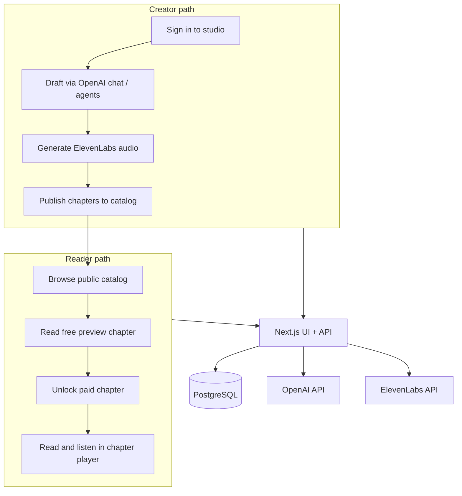

# Atelier — Solution Documentation

**Document type:** Technical solution brief (full-stack SaaS MVP)  
**Version:** 1.0 · 2026-06-12  
**Related artifacts:** `docs/presentation.pdf`, `docs/atelier-presentation.mp4`, `docs/CCC_DELIVERABLE_REPORT.md`

---

## Executive summary

Atelier is a serialized audiobook platform that connects a **private creator studio** (AI-assisted drafting, TTS narration, publishing) with a **public reader catalog** (discovery, chapter preview, paid unlock, in-flow listening) in one Next.js application. The MVP demonstrates an end-to-end creator → reader pipeline with OpenAI generation, ElevenLabs narration, PostgreSQL persistence, and Auth.js session management. Effectiveness is supported by structured walkthrough feedback, shipped UX iterations, and an automated smoke test suite (`pnpm test:smoke`). Remaining limitations—stub chapter checkout, expanding CI coverage, native mobile clients—are documented with a concrete improvement plan.

---

## Audience

| Audience | Background | Purpose of this documentation |
|----------|------------|------------------------------|
| **Technical reviewers** | Software engineering, full-stack web, SaaS | Evaluate architecture, implementation choices, test evidence, and production readiness |
| **Product stakeholders** | Creators, studio operators, business owners | Understand what the platform does, who it serves, and monetization path |
| **Future maintainers** | Engineers extending the codebase | Locate stack decisions, security posture, known gaps, and reference docs |

The presentation (`docs/presentation.md`) and video (`docs/atelier-presentation.mp4`) use formal, objective language and assume familiarity with web applications but not with this repository.

---

## Problem statement

See `docs/PROBLEM_STATEMENT.md`.

**Summary:** Independent creators who publish serialized audio fiction cannot move from draft manuscript to monetized, listenable chapters in one workflow without stitching together separate writing, audio, storefront, and catalog tools.

---

## Solution overview

### What the solution is

Atelier (repository name: AI-Novel) is a **full-stack web application** that provides:

- A **creator studio** (`/studio`, `/library`) for AI-assisted chapter drafting, revision, voice casting, and publication
- A **reader catalog** (`/`, `/store`) for series discovery, free previews, paid chapter unlocks, and chapter playback
- A **shared backend** (Next.js route handlers + PostgreSQL) that enforces access rules, persists serial content, and calls external AI/TTS providers server-side

It is **not** an open multi-author marketplace; it is a **creator-owned production and distribution stack** for Pocket-FM-style serial fiction.

### How the solution works

| Step | Actor | Surface | Technical behavior |
|------|-------|---------|-------------------|
| 1 | Creator | `/studio` | Multi-turn prompts to OpenAI; isolated agent drafts stored in `studio_*` tables |
| 2 | Creator | `/library` | Story/chapter CRUD; publication status controls catalog visibility |
| 3 | Creator | Voice console / TTS APIs | Server routes call ElevenLabs; usage tracked and tier-capped |
| 4 | Reader | `/` | Public catalog lists published series and chapters |
| 5 | Reader | `/store` | Access rules: preview, owner, unlocked, or locked; unlock via checkout flow |
| 6 | Reader | Chapter player | Text + audio playback for entitled chapters |

### Key design choices

| Choice | Alternatives considered | Rationale |
|--------|-------------------------|-----------|
| **Next.js App Router** | Separate React SPA + Express API | One deployable unit; faster iteration for a small team; shared types between UI and handlers |
| **PostgreSQL + Drizzle ORM** | MongoDB, Prisma | Relational model fits stories, chapters, unlocks, comments, and Auth.js tables; type-safe schema |
| **Server-side OpenAI / ElevenLabs** | Client-side SDK calls | API keys never reach the browser; centralized metering and error handling |
| **Auth.js (NextAuth) + JWT sessions** | Custom auth | Industry-standard session handling; Drizzle adapter aligns with existing schema |
| **API-first route handlers** | Web-only monolith | Same endpoints can serve future iOS/Android clients without rewriting business logic |
| **Stub checkout → Stripe** | Immediate Stripe-only | Validated unlock UX and access states before payment-provider hardening |

---

## Effectiveness against objectives

| Original objective | Result | Evidence |
|------------------|--------|----------|
| End-to-end creator → reader pipeline in one application | **Met (MVP)** | Catalog, studio, library, and chapter player functional; demo screenshots in `docs/screenshots/` |
| LLM-assisted authoring + TTS narration integrated | **Met (MVP)** | OpenAI `/api/ai/chat`; ElevenLabs `/api/tts/*`; server-side provider modules |
| Validate via structured feedback and automated tests | **Met (partial)** | Feedback log in `docs/CCC_DELIVERABLE_REPORT.md`; smoke suite `scripts/smoke-sprint3.ts` / `pnpm test:smoke` |
| Production-grade payments | **Not yet met** | Stub unlock flow; Stripe integration planned |
| Comprehensive CI regression gates | **Not yet met** | Smoke tests exist; full CI pipeline expanding |

### Feedback → iteration (selected)

| Observation | Severity | Change shipped |
|-------------|----------|----------------|
| Locked chapter value unclear | Medium | Lock reason and benefit copy on store views |
| Session expiry during unlock | High | Re-auth prompt and explicit error messages |
| Draft vs published state confusing | Medium | Published / Draft badges on story detail |
| No repeatable API validation | High | Smoke test suite for auth, catalog, unlock guards, story CRUD |

---

## Limitations, tradeoffs, and planned improvements

| Limitation / tradeoff | Why it exists | Planned improvement | Expected benefit |
|----------------------|---------------|---------------------|------------------|
| Stub chapter checkout | De-risked UX before Stripe integration | Stripe-backed unlock verification | Real revenue and auditable transactions |
| Limited CI automation | Team prioritized MVP flows over pipeline | GitHub Actions + broader API tests | Faster regression detection |
| TTS tier caps | Controls ElevenLabs cost during development | Usage dashboards + queueing for scale | Predictable operating cost at volume |
| Web-only client | API-first milestone sequencing | Native iOS/Android on same API | Mobile store distribution |
| AI output variance | LLM non-determinism | Prompt templates, evaluation sets, moderation | More consistent paid-tier quality |

---

## Security and legal considerations

| Topic | Implementation | Reference |
|-------|----------------|-----------|
| **API key protection** | `OPENAI_API_KEY`, `ELEVENLABS_API_KEY` used only in server route handlers | `docs/APP_PRIVACY_DATA_INVENTORY.md` §4 |
| **Authentication** | Auth.js JWT sessions; bcrypt password hashes | `docs/APP_PRIVACY_DATA_INVENTORY.md` §2 |
| **Account deletion** | User-initiated deletion from `/account` | `docs/APP_PRIVACY_DATA_INVENTORY.md` §2 |
| **Third-party data processing** | Manuscript text sent to OpenAI; narration text sent to ElevenLabs | Privacy inventory; provider terms of service |
| **Payments (future)** | PCI scope minimized via Stripe-hosted checkout (planned) | `docs/CLIENT_PRICING_AND_TCO.md` |
| **Content policy** | Operator-defined rules for offensive or illegal content (client responsibility) | `docs/CLIENT_PRICING_AND_TCO.md` checklist |

---

## Graphics and visuals

| Visual | Location | Purpose |
|--------|----------|---------|
| Architecture flow diagram | This document (Mermaid); `docs/CCC_DELIVERABLE_REPORT.md` | Shows system components and data flow |
| Product screenshots | `docs/screenshots/`; presentation slide 04 · Demo | Labels: catalog, studio, chapter player |
| Stack / feedback tables | `docs/presentation.pdf` slides 05–06 | Summarize technical decisions and validation evidence |
| Video walkthrough | `docs/atelier-presentation.mp4` | Narrated explanation tied to labeled slides |

---

## Citations and sources

Tools, frameworks, and external services cited in this project:

| Source | Role | URL |
|--------|------|-----|
| Next.js | Full-stack React framework (App Router) | https://nextjs.org/docs |
| React | UI library | https://react.dev |
| PostgreSQL | Relational database | https://www.postgresql.org/docs/ |
| Drizzle ORM | Type-safe SQL schema and queries | https://orm.drizzle.team/docs/overview |
| Auth.js (NextAuth) | Authentication and sessions | https://authjs.dev |
| OpenAI API | LLM text generation | https://platform.openai.com/docs |
| ElevenLabs API | Text-to-speech narration | https://elevenlabs.io/docs |
| Remotion | Programmatic presentation video | https://www.remotion.dev/docs |
| Marp | Markdown presentation export | https://marp.app |

Internal references: `README.md`, `docs/PROBLEM_STATEMENT.md`, `docs/STAKEHOLDERS.md`, `docs/CCC_TASK_BOARD.md`, `docs/CHANGELOG.md`.

---

## Further investigation

| Next step | Resource |
|-----------|----------|
| Full problem analysis and sprint plan | `docs/CCC_DELIVERABLE_REPORT.md` |
| Sprint tasks and completion status | `docs/CCC_TASK_BOARD.md` |
| Operating cost scenarios | `docs/CLIENT_PRICING_AND_TCO.md` |
| Privacy and store compliance | `docs/APP_PRIVACY_DATA_INVENTORY.md` |
| Local setup and environment variables | `README.md`, `.env.example` |
| Run smoke validation | `pnpm test:smoke` |

---

## Version history

See `docs/CHANGELOG.md` for major documentation and deliverable updates.

---

## Level 12 checklist — Communicating and Documenting My Solution

| Criterion | How this deliverable meets it |
|-----------|-------------------------------|
| **Industry-accepted format** | Technical solution brief with executive summary, architecture, evidence, limitations, citations, and version history — aligned with professional software documentation conventions |
| **Clear solution explanation** | § Solution overview — what Atelier is, how creator/reader paths work, key design choices with rationale |
| **Effectiveness** | § Effectiveness against objectives — objectives mapped to results and evidence (feedback log, smoke tests, screenshots) |
| **Field norms and conventions** | Formal tone; standard stack vocabulary (App Router, ORM, JWT, TTS, API-first); agile sprint artifacts referenced |
| **Technical terms** | Terms used precisely: Drizzle ORM, route handlers, stub checkout, serial unlock model, server-side provider calls |
| **Graphics and visuals** | Labeled screenshots, architecture diagrams, presentation tables and video — § Graphics and visuals |
| **Citations and sources** | § Citations and sources — tools linked with official documentation URLs |
| **Audience** | § Audience — backgrounds and purposes defined; presentation adjusted for technical reviewers |
| **Organization** | Problem → solution → architecture → effectiveness → limitations → security → references |
| **Formal and objective tone** | Documentation avoids slang; claims tied to evidence; limitations stated explicitly |
| **Limitations and improvements** | § Limitations — tradeoffs with planned improvements and expected benefits |
| **Further investigation** | § Further investigation — next steps and doc links |
| **Legal and security** | § Security and legal; privacy inventory; changelog in `docs/CHANGELOG.md` |
| **One-sentence success check** | A reviewer can determine what Atelier is, how it works, how effective the MVP is, field-appropriate conventions, supporting evidence, remaining limitations, and improvement path from this document and linked artifacts |
