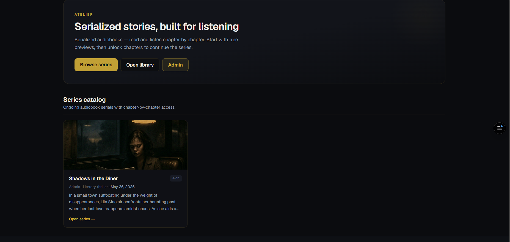
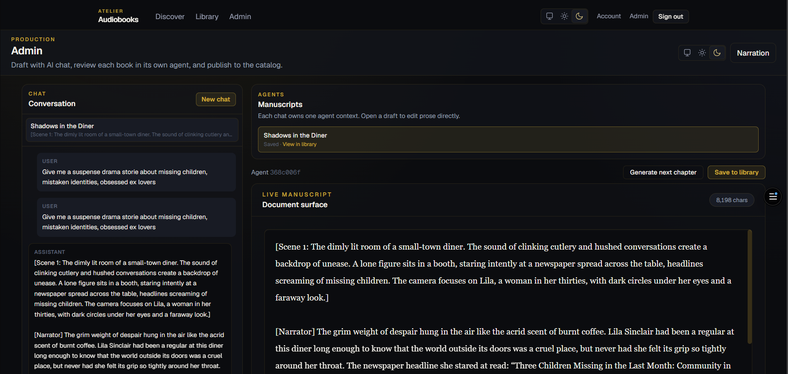
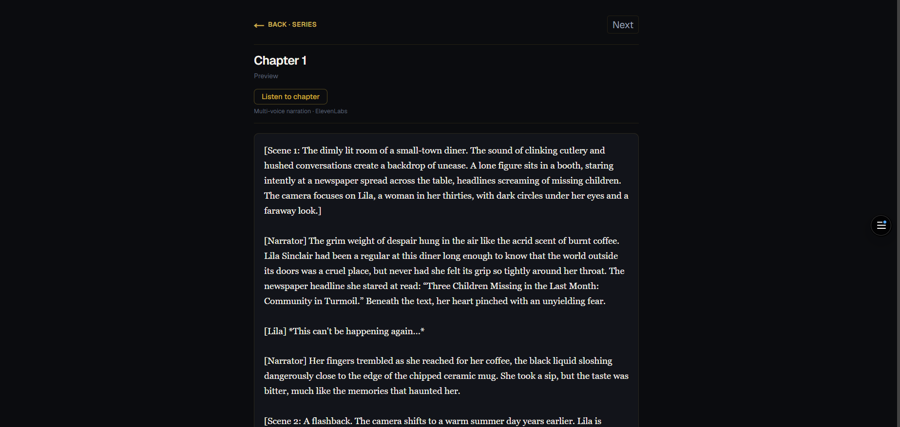

<!-- _class: lead -->

# Atelier

Serialized audiobooks — read and listen chapter by chapter

  AI Studio
  Reader Catalog
  Chapter Audio
  Next.js

~90%

Lower prod. cost vs studio

$0.99–1.49

Per-chapter unlock

1 stack

Draft → audio → sell

100%

Client-owned catalog

Level 12 solution documentation · commissioned for an independent studio operator

<!--
~30 sec — Open with product name and one-line pitch.
-->

---

<!-- _class: dense -->

## 01 · Problem The Client's Challenge

### Problem statement
Independent creators who publish **serialized audio fiction** cannot move from draft manuscript to **monetized, listenable chapters** in one workflow. Writing, narration, catalog hosting, and per-chapter sales live in **separate tools**—not built for serial unlock models.

5+ apps

Typical DIY toolchain

$200+/hr

Human studio narration

3 steps

Reader expects: preview · unlock · listen

### Pain points
<ul class="feature-list">
<li>Production is <strong>slow & expensive</strong> across fragmented tools</li>
<li>Readers expect <strong>preview → unlock → continue</strong> in one flow</li>
<li><strong>No owned stack</strong> built for a private studio operator</li>
<li>Aggregator platforms take <strong>margin + IP risk</strong></li>
</ul>

### What the client needs
<ul class="feature-list">
<li><strong>Exclusive</strong> private production workspace (`/studio`)</li>
<li><strong>Owned catalog</strong> with chapter-by-chapter sales</li>
<li><strong>AI + TTS + payments</strong> without juggling five apps</li>
<li><strong>Pocket-FM economics</strong> on infrastructure they control</li>
</ul>

---

<!-- _class: dense -->

## 02 · Market Competitive Landscape

<table class="slide-table">
<colgroup><col class="col-a" /><col class="col-b" /></colgroup>
<thead><tr><th>Alternative</th><th>Why it falls short for our client</th></tr></thead>
<tbody>
<tr><td><strong>Pocket FM</strong> &amp; serial apps</td><td>Strong listener UX — client does <strong>not</strong> own production or catalog</td></tr>
<tr><td><strong>Wattpad</strong> · Vella · Radish</td><td>Serial fiction — no integrated <strong>AI + TTS + owned</strong> workflow</td></tr>
<tr><td><strong>DIY toolchain</strong></td><td>Scrivener + ElevenLabs + payments — <strong>slow</strong>, <strong>expensive</strong>, poor unlock UX</td></tr>
<tr><td><strong>AI writers alone</strong></td><td>Fast drafting — <strong>no</strong> catalog, audio, or chapter monetization</td></tr>
</tbody>
</table>

<strong>Market gap:</strong> Strong serial-fiction demand exists—but no platform gives an indie operator <em>owned production + owned catalog + AI + TTS + chapter unlocks</em> in one stack.

<strong>Atelier</strong> — private studio → narrate → publish → unlock → listen, in one app the client controls.

<!--
~45 sec — Frame the business gap, objectives, and why it matters.
-->

---

<!-- _class: dense -->

## 03 · Audience Client &amp; End Users

1

### The client
Independent **studio operator** — exclusive private production workspace (not a multi-author marketplace)

`/studio` · `/library` · owns the catalog

2

### Readers
Paying customers who discover serials and unlock chapters

`/` · `/store`

3

### Listeners
Read and listen in one flow — chapter text + ElevenLabs TTS

Chapter player

Free

Preview chapters (hook)

$0.99–1.49

Paid unlock / chapter

0%

Aggregator revenue share

### Business model &amp; revenue flow
<strong>Discover</strong> on public catalog → <strong>preview</strong> free installments → <strong>unlock</strong> paid chapters → <strong>consume</strong> text + ElevenLabs audio in one player. Client <strong>owns catalog, pricing, and margin</strong>—not a multi-author marketplace.

Presentation audience: client stakeholders and technical reviewers evaluating feasibility, architecture, and delivery evidence.

---

<!-- _class: dense -->

## 04 · Solution What Atelier Is &amp; How It Works

### What the solution is
<strong>Atelier</strong> is a full-stack web application unifying a <strong>private AI studio</strong>, <strong>text-to-speech narration</strong>, <strong>serial catalog publishing</strong>, and <strong>chapter-by-chapter monetization</strong> in one Next.js codebase.

### Creator path
1. **Draft** — OpenAI chat + agents (`/studio`)
2. **Narrate** — Server-side ElevenLabs TTS
3. **Publish** — Story/chapter management (`/library`)

### Reader path
1. **Discover** — Public catalog (`/`)
2. **Preview** — Free chapters
3. **Unlock** — Paid access (`/store`)
4. **Consume** — Chapter player (text + audio)

~$2.50

TTS / ~10-min chapter

~$0.04

LLM draft pass

~3 unlocks

Break-even @ $0.99

~90%

Lower cost vs studio

### Creative guardrails (serial memory)
<ul class="feature-list">
<li><strong>Per-thread agent isolation</strong> — no cross-book bleed</li>
<li><strong>Story-controls schema</strong> — genre, mood, tension, sophistication</li>
<li><strong>Prior-chapter injection</strong> — plot continuity across 50+ chapters</li>
<li><strong>Quality retries</strong> + <strong>[Speaker]</strong> tag preservation on refine</li>
</ul>

### Data sovereignty
<ul class="feature-list">
<li><strong>PostgreSQL</strong> owns manuscripts, unlock ledgers, comments</li>
<li>OpenAI &amp; ElevenLabs are <strong>swappable server adapters</strong></li>
<li>Provider change ≠ IP loss — assets stay in client DB</li>
</ul>

---

<!-- _class: dense -->

## 05 · Product What We Shipped

<figure>

<figcaption>1 · Reader catalog</figcaption>
</figure>
<figure>

<figcaption>2 · Creator studio</figcaption>
</figure>
<figure>

<figcaption>3 · Chapter audio</figcaption>
</figure>

  Catalog→
  Studio→
  Listen + unlock

<strong>AI studio</strong>
<ul class="feature-list">
<li>OpenAI chat + isolated agents</li>
<li>Live manuscript + refine loops</li>
<li>Admin-only `/studio` workspace</li>
</ul>

<strong>Owned catalog</strong>
<ul class="feature-list">
<li>Publish &amp; price per chapter</li>
<li>Free preview + paid unlock rules</li>
<li>Public `/` + `/store` storefront</li>
</ul>

<strong>Chapter audio</strong>
<ul class="feature-list">
<li>ElevenLabs TTS in-player</li>
<li>Lock-state UX from walkthroughs</li>
<li>Text + audio single surface</li>
</ul>

---

<!-- _class: dense -->

## 06 · Differentiation Why Atelier Wins

<table class="slide-table">
<colgroup><col class="col-a" /><col class="col-b" /></colgroup>
<thead><tr><th>Atelier advantage</th><th>Product benefit</th></tr></thead>
<tbody>
<tr><td><strong>Private studio</strong> — not a marketplace</td><td>Client controls IP, voice, and release cadence</td></tr>
<tr><td><strong>Write + narrate + sell</strong> in one app</td><td>Faster chapters, lower production cost</td></tr>
<tr><td><strong>Serial unlock UX</strong> built-in</td><td>Preview → pay → continue—like Pocket FM, but owned</td></tr>
<tr><td><strong>API-first</strong> web MVP</td><td>Same backend for future iOS/Android apps</td></tr>
<tr><td><strong>Owned PostgreSQL IP layer</strong></td><td>Manuscripts, unlock ledgers, reader data—<strong>no vendor lock-in</strong></td></tr>
<tr><td><strong>Swappable AI providers</strong></td><td>OpenAI &amp; ElevenLabs are server adapters; core assets stay in client DB</td></tr>
</tbody>
</table>

<strong>Bottom line:</strong> Pocket-FM listener UX + indie-studio economics + zero aggregator lock-in — on infrastructure the client owns.

---

<!-- _class: dense -->

## 07 · Architecture How We Built It

<table class="slide-table">
<colgroup><col class="col-a" /><col class="col-b" /></colgroup>
<thead><tr><th>Stack</th><th>Rationale</th></tr></thead>
<tbody>
<tr><td><strong>Next.js App Router</strong></td><td>UI + API in one codebase — fast delivery for the client</td></tr>
<tr><td><strong>PostgreSQL + Drizzle</strong></td><td>System of record for IP, unlock ledgers, comments — <strong>data portability</strong></td></tr>
<tr><td><strong>Serial memory</strong></td><td>Prior chapters + story-controls schema injected into LLM context per generation</td></tr>
<tr><td><strong>OpenAI + ElevenLabs</strong></td><td>Swappable server-side adapters — keys never in the browser</td></tr>
<tr><td><strong>Auth.js</strong></td><td>Sessions, account deletion, admin studio access</td></tr>
<tr><td><strong>API-first</strong></td><td>Web MVP today · iOS/Android on same API later</td></tr>
</tbody>
</table>

  Client studio / Readers→
  Next.js API→
  PostgreSQL→
  OpenAI · ElevenLabs

6 routes

Core API surfaces

Server-only

AI keys never in browser

API-first

Mobile = same REST layer

TCO: <code>docs/CLIENT_PRICING_AND_TCO.md</code> · Privacy: <code>docs/APP_PRIVACY_DATA_INVENTORY.md</code>

---

<!-- _class: dense -->

## 08 · Effectiveness Objectives, Evidence &amp; Feedback

<table class="slide-table">
<colgroup><col class="col-a" /><col class="col-b" /><col class="col-b" /></colgroup>
<thead><tr><th>Objective</th><th>Result</th><th>Evidence</th></tr></thead>
<tbody>
<tr><td>End-to-end creator → reader pipeline</td><td>Met MVP</td><td><code>/</code> · <code>/studio</code> · <code>/library</code> · player</td></tr>
<tr><td>LLM authoring + TTS narration</td><td>Met MVP</td><td>OpenAI + ElevenLabs server routes</td></tr>
<tr><td>Structured feedback + smoke tests</td><td>Partial</td><td>Walkthroughs + <code>pnpm test:smoke</code></td></tr>
<tr><td>Documented unit economics</td><td>Met</td><td><code>docs/CLIENT_PRICING_AND_TCO.md</code></td></tr>
</tbody>
</table>

<table class="slide-table">
<colgroup><col class="col-a" /><col class="col-b" /></colgroup>
<thead><tr><th>Feedback</th><th>Shipped fix</th></tr></thead>
<tbody>
<tr><td>Locked chapters unclear</td><td>Lock reason + value copy</td></tr>
<tr><td>Session expiry during checkout</td><td>Re-auth prompt + clear errors</td></tr>
<tr><td>Publish state confusing</td><td><strong>Published</strong> vs <strong>Draft</strong> badges</td></tr>
<tr><td>No regression safety</td><td>Smoke suite <code>pnpm test:smoke</code></td></tr>
</tbody>
</table>

Validation combined <strong>structured walkthroughs</strong>, <strong>client feedback loops</strong>, and <strong>automated smoke tests</strong> on auth, catalog, studio, and checkout paths.

---

<!-- _class: dense limitations -->

## 09 · Limitations Phased Rollout &amp; Risk Controls

<table class="limitations-table">
<tbody>
<tr>
<td>

<h3>Live Phase 1 — MVP delivered</h3>
<ul>
<li>Web client · owned catalog · full studio pipeline</li>
<li>Stub checkout · TTS tier caps for <strong>cost control</strong></li>
<li>Smoke tests on auth, catalog, studio, checkout APIs</li>
<li>Documented TCO + privacy inventory for stakeholders</li>
</ul>

</td>
<td>

<h3>Next Phase 2–3 — no DB redesign</h3>
<ul>
<li><strong>Stripe</strong> — verified per-chapter unlock revenue</li>
<li><strong>CI</strong> — broader API regression before production launch</li>
<li><strong>Mobile</strong> — React Native / Flutter on <strong>same REST endpoints</strong></li>
<li>Architecture decoupled <strong>day one</strong> — not retrofit</li>
</ul>

</td>
</tr>
<tr>
<td colspan="2">

<h3>Security &amp; legal</h3>
<ul>
<li>Provider API keys stored <strong>server-side only</strong> (OpenAI, ElevenLabs)</li>
<li>Privacy/data inventory: <code>docs/APP_PRIVACY_DATA_INVENTORY.md</code></li>
<li>Account deletion via Auth.js · content policy is operator-defined</li>
<li>Version history: <code>docs/CHANGELOG.md</code></li>
</ul>

</td>
</tr>
</tbody>
</table>

---

<!-- _class: dense -->

## 10 · Roadmap Post-MVP Scaling Strategy

<table class="slide-table">
<colgroup><col class="col-a" /><col class="col-b" /></colgroup>
<thead><tr><th>Phase</th><th>Deliverable — same API &amp; PostgreSQL schema</th></tr></thead>
<tbody>
<tr><td>Phase 1 Now</td><td>Web MVP · studio pipeline · stub checkout · unit economics documented · smoke tests live</td></tr>
<tr><td>Phase 2 Q-next</td><td>Stripe live revenue · expanded CI · production hardening · unlock ledger verified</td></tr>
<tr><td>Phase 3 Scale</td><td>React Native / Flutter · same REST API · zero schema migration · reader apps on owned backend</td></tr>
</tbody>
</table>

### Strategic position
Serialized audio fiction is growing; indie operators want <strong>Pocket-FM economics</strong> without <strong>aggregator lock-in</strong> — TCO, privacy inventory, and solution docs in <code>docs/</code>

  Stripe
  Mobile
  Owned catalog
  Chapter audio

---

<!-- _class: dense -->

## 11 · References Citations &amp; Further Investigation

### Sources cited
<ul class="feature-list">
<li><strong>Next.js App Router</strong> — nextjs.org/docs</li>
<li><strong>PostgreSQL</strong> + <strong>Drizzle ORM</strong> — orm.drizzle.team</li>
<li><strong>OpenAI API</strong> — platform.openai.com/docs</li>
<li><strong>ElevenLabs</strong> — elevenlabs.io/docs</li>
<li><strong>Auth.js</strong> — authjs.dev</li>
</ul>

### Further investigation
<ul class="feature-list">
<li><code>SOLUTION_DOCUMENTATION.md</code> — Level 12 brief + rubric mapping</li>
<li><code>CCC_DELIVERABLE_REPORT.md</code> — plan, risks, test evidence</li>
<li><code>CLIENT_PRICING_AND_TCO.md</code> — per-chapter economics</li>
<li><code>Q_AND_A_BRIEF.md</code> — post-presentation Q&amp;A prep</li>
<li><code>CHANGELOG.md</code> — version history</li>
</ul>

---

<!-- _class: closing lead -->

## 12 · Close Summary

Owned IP

Catalog + unlock ledgers in PostgreSQL

Phased scale

Stripe → CI → mobile on same API

### Success check
Client-owned ecosystem with <strong>documented unit economics</strong>, <strong>creative guardrails</strong> for long-form serials, <strong>data sovereignty</strong>, and a <strong>defined post-MVP scaling path</strong>.

  Unit economics
  Owned catalog
  No lock-in
  Phased scale

Questions?

